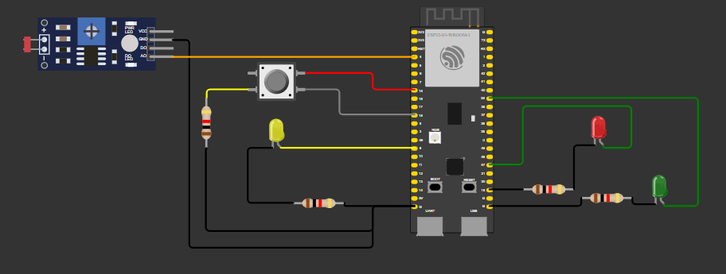
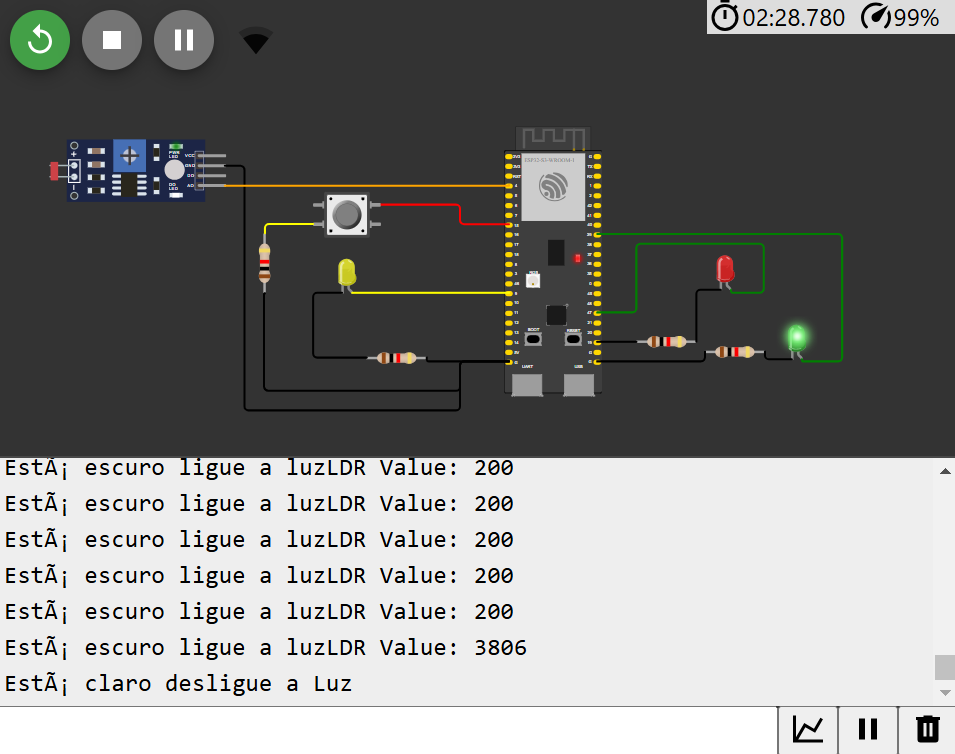
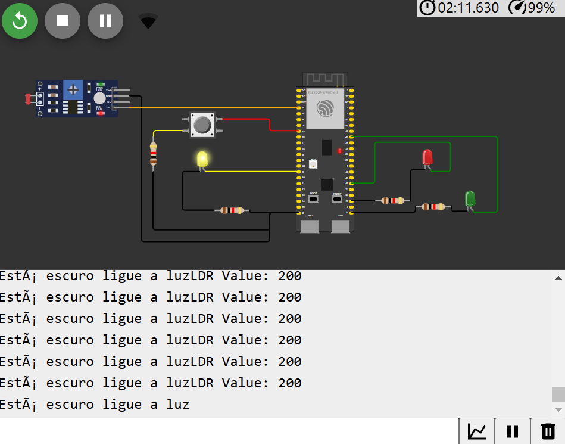

# Documentação da Prova Prática - 4 Módulo

Você foi contratado como desenvolvedor de IoT para uma empresa que fabrica semáforos inteligentes para uma pequena cidade. Como parte de seus processos, a empresa desenvolve seus projetos de semáforos em simuladores antes de embarcar o software nos produtos finais. 

O desenvolvedor sênior que estava te mentorando foi para outra empresa às pressas e deixou uma tarefa para você como presente. Eis o projeto que ele estava trabalhando e deixou para você:

https://wokwi.com/projects/413645635576658945

O projeto não está terminado, e sua tarefa será realizar as tarefas abaixo para finalizá-lo. 

---

### Conexões e Circuito

Conforme solicitado pelo enunciado da questão, o circuito final ficou da seguinte forma (imagem abaixo), isso porquê diversos erros foram encontrados no decorrer dos testes realizados, sendo esses:

* Resistor do Led Amarelo não estava conectado no GND da ESP;
* Estava sendo utilizada a porta errada de conexão do sensor LDR no ESP;
* Led Vermelho estava conectado em uma porta de saída do ESP;

Considerando isso, as seguintes correções foram feitas:

* Resistor do Led amarelo foi conectado ao GND 1 da ESP;
* Foi utilizada a Porta AO do LDR para conectar na porta 4 do ESP;
* Led vermelho foi conectado na porta 47 do ESP;

Todas as alterações descritas acima podem ser vistas no seguinte [arquivo](diagram.json).

---

### Funcionalidade do Sistema

Devido ao curto tempo de prova e as falhas de conexão do simulador Wokwi, não foi possível implementar todas as funcionalidades, entretanto o que foi possível implementar consiste em:

* Código modularizado usando uma classe para controle do semáforo;

* Uso de ponteiros tornando o código mais robusto e eficiente;

* Uso da função `millis()` evitando os atrasos do código com a função `delay()`.

* Leitura do Sensor LDR e controle dos LED a partir dessa leitura:

    * Se o valor lido for maior que 600: o Semáforo é ativado, sendo assim o Led Vermelho fica acesso por 5 segundos, depois o led amarelo acende por 2 segundos, por fim o led verde fica acesso por 3 segundos, conforme consta na imagem abaixo.

    

    * Se o valor lido for menor ou igual a 600: o modo noturno é ativado então o Led Amarelo fica acesso, conforme consta na imagem abaixo.

    

O restante das funcionalidades foi implementado no código mas não chegaram a serem testadas, sendo essas: o debounce do botão, e se o semaforo estiver ligado (led vermelho aceso) e o usuário apertar o botão o led verde é aceso após 1 segundo. 

Para visualizar a implementação dessas funcionalidades basta acessar os seguintes anexos:

1. [Vídeo](https://drive.google.com/file/d/1NMPM4ji2TyLD-gjDR5T5YlB2vEAXhQu9/view?usp=drive_link)
2. [Código](sketch.ino)